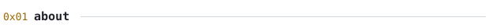
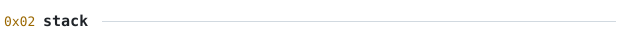
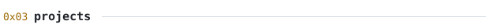
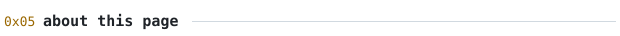

[hemeshkanyal.com](https://hemeshkanyal.com) &nbsp;·&nbsp;
[linkedin](https://linkedin.com/in/hemeshkanyal22) &nbsp;·&nbsp;
[x](https://x.com/HemeshKanyal) &nbsp;·&nbsp;
[email](mailto:hemeshkanyal22@gmail.com)

> I build blockchain systems that have to survive contact with the real world: 
> medicine that must stay cold, assets that must stay legal, identities that stay private.

Smart contracts on Foundry, zero-knowledge proofs in Noir, and the boring parts 
around them that make a chain useful: ESP32 firmware, indexers, relayers, and 
frontends people can actually use. Right now that's [RiskLens](https://github.com/HemeshKanyal/RiskLens) and [ASCENT](https://github.com/HemeshKanyal/ASCENT-Frontend).

<samp>solidity &nbsp; foundry &nbsp; noir &nbsp; typescript &nbsp; python</samp> 
<samp>next.js &nbsp; react native &nbsp; node &nbsp; fastapi &nbsp; mongodb &nbsp; esp32</samp>

**[trustchain](https://github.com/HemeshKanyal/trustchain)** &nbsp;·&nbsp; <samp>solidity, foundry, esp32, next.js</samp> &nbsp;·&nbsp; [live](https://trustchain.hemeshkanyal.com) 
Medicines tracked from factory to patient. On-chain custody, ESP32 cold-chain 
boxes that sign their own sensor reports, and recalls that reach exactly the 
patients who were affected.

**[bharatrwa](https://github.com/HemeshKanyal/BharatRWA)** &nbsp;·&nbsp; <samp>solidity, foundry, noir</samp> &nbsp;·&nbsp; [live](https://bharatrwa.hemeshkanyal.com) 
Gold, silver and real estate as ERC-20 tokens, with ZK-KYC: prove you're over 
18 or in an allowed region without revealing who you are. Dividends from the 
underlying asset go straight to holders.

**[risklens](https://github.com/HemeshKanyal/RiskLens)** &nbsp;·&nbsp; <samp>next.js, fastapi, noir</samp> &nbsp;·&nbsp; [live](https://risklens.hemeshkanyal.com) 
Portfolio risk in plain language: volatility, concentration, correlation, and 
your holdings replayed through 2008, 2020 and 2022. The optional identity check 
is a zero-knowledge proof made in your browser, so your details never leave it.

**[ascent](https://github.com/HemeshKanyal/ASCENT-Frontend)** &nbsp;·&nbsp; <samp>react native, expo, node, mongodb</samp> &nbsp;·&nbsp; [live](https://ascent.hemeshkanyal.com) 
A workout tracker that picks your training split from your goal, experience 
and the days you actually have, then logs every session against it.

Nothing on this page loads from anyone else's server. Every graphic is drawn by 
[`scripts/generate.py`](scripts/generate.py) from the GitHub GraphQL API, run once a day by 
[a scheduled action](.github/workflows/refresh.yml) that commits only when something changed.

The chain above is my last year read as a blockchain: each week is a block, each 
contribution a transaction, and the current week stays dashed until it's mined. 
Animation is SMIL inside the SVGs, since GitHub strips scripts and CSS from READMEs. 
The typeface is [JetBrains Mono](assets/fonts), subset to about 100 glyphs and inlined.

Languages cover public, non-fork repositories; notebooks are left out of the byte 
count because their size is mostly embedded output.
